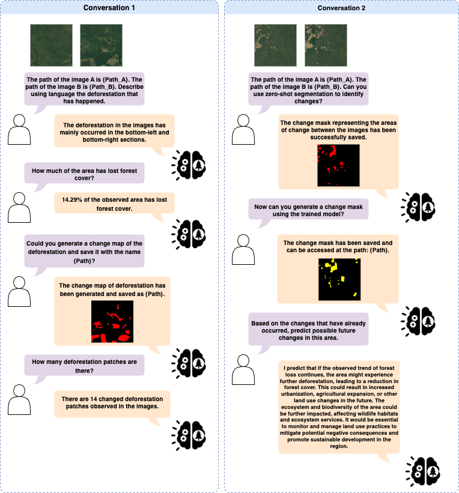
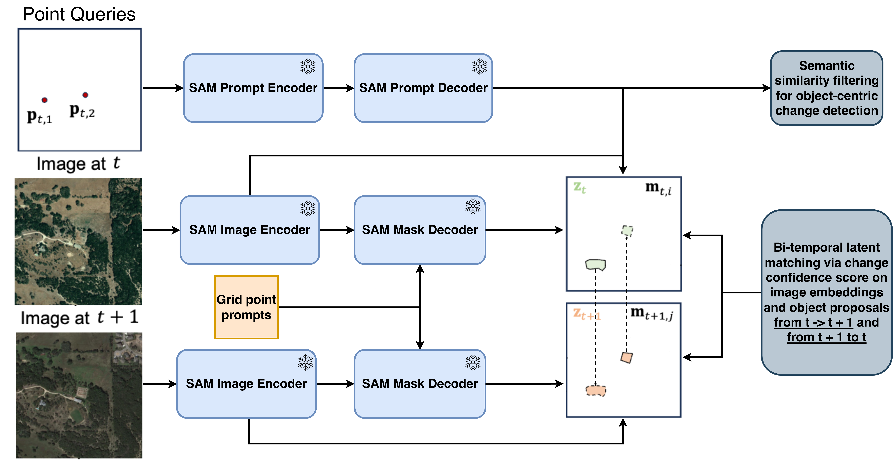
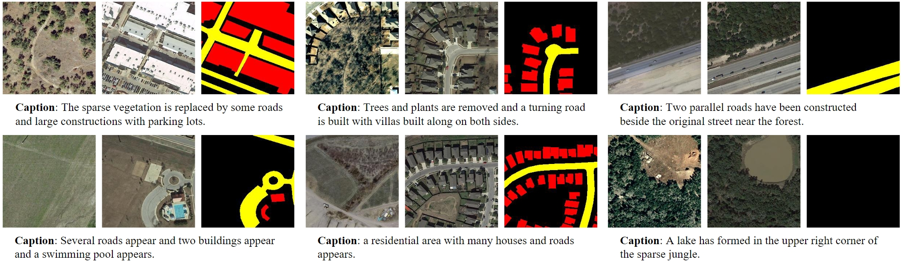
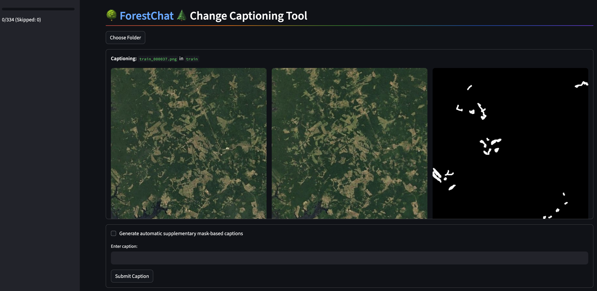
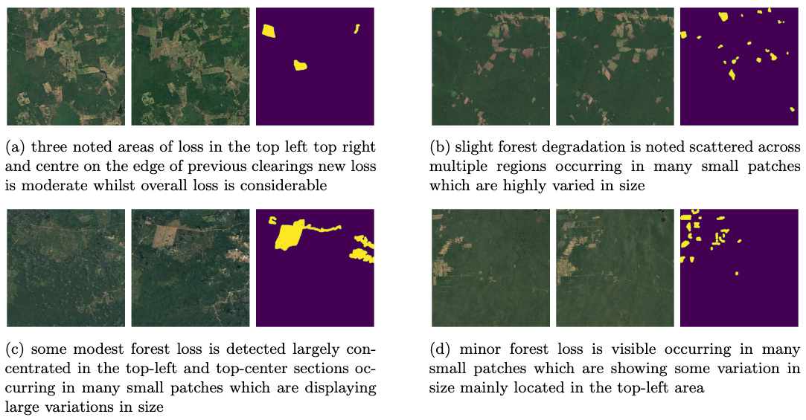
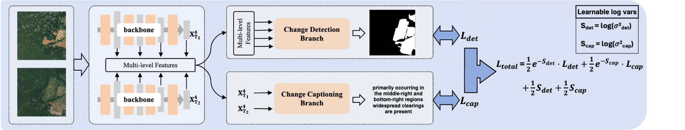
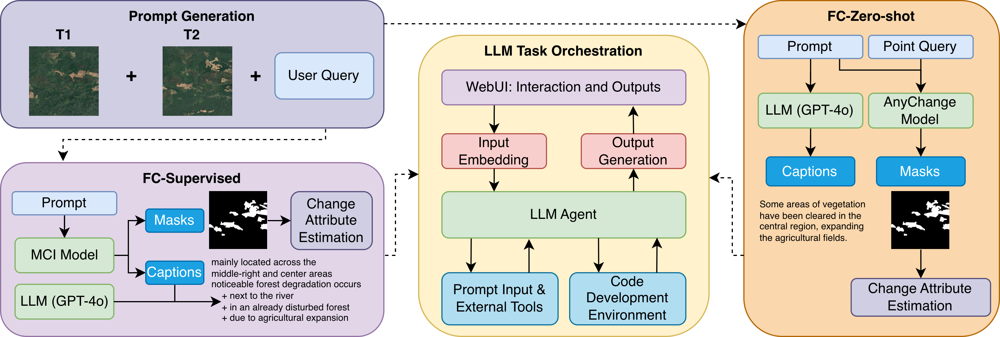
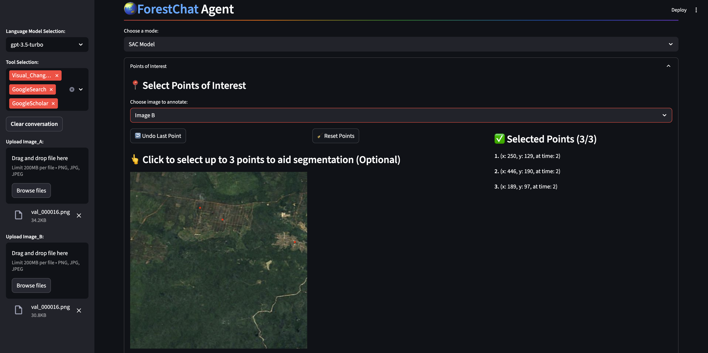

<div align="center">
    
<h1>Forest-Chat: Adapting Vision-Language Models for Interactive Forest Change Analysis</h1>

<div align="center">
  
</div>
</div>

## Table of Contents
- [Preparation](#preparation)
- [LEVIR-MCI-Trees dataset](#levir-mci-trees-dataset)
- [Forest-Change dataset](#forest-change-dataset)
- [JL1-CD-Trees dataset](#jl1-cd-trees-dataset)
- [Training of the adapted multi-level change interpretation model](#training-of-the-adapted-multi-level-change-interpretation-model)
- [GPT-4o Zero-Shot and Refinement Captioning](#gpt-4o-zero-shot-and-refinement-captioning)
- [Few-Shot Fine-Tuning](#few-shot-fine-tuning)
- [AnyChange2 (SAM2-based)](#anychange2-sam2-based)
- [Hyperparameter Search (AnyChange and AnyChange2)](#hyperparameter-search-anychange-and-anychange2)
- [Construction of Forest-Chat](#construction-of-forest-chat)
- [Acknowledgement](#acknowledgement)
- [License](#license)

### Preparation
    
- **Environment Installation**:
    <details open>
    
    **Step 1**: Create a virtual environment named `Multi_change_env` and activate it.
    ```python
    conda create -n Multi_change_env python=3.11
    conda activate Multi_change_env
    ```
    
    **Step 2**: Download or clone the repository.
    ```python
    git clone https://github.com/JamesBrockUoB/ForestChat.git
    cd ./ForestChat/Multi_change
    ```
    
    **Step 3**: Install dependencies.
    ```python
    pip install -r requirements.txt
    ```
    </details>

    **Step 4**: Setup .env file.
    Create a file in the project root folder called `.env` with the following variables:
      - OPENAI_API_KEY: Your OPEN_AI API key - https://platform.openai.com/api-keys
      - SERPER_API_KEY - Your Google Search / Scholar API key - https://serpapi.com/
      - WANDB_USERNAME - Your Weights & Biases username for run logging - https://wandb.ai/site/
    
    **Step 5**: Download AnyChange
    <details open>
    
    Link: [AnyChange](https://github.com/facebookresearch/segment-anything?tab=readme-ov-file#model-checkpoints)

    Place the downloaded model into: `Multi_change/models_ckpt/` with the name unchanged (`sam_vit_h_4b8939.pth`)

    Simplified overview of the AnyChange model:
    <br>
    <div align="center">
          
    </div>

## LEVIR-MCI-Trees dataset 
- Download the LEVIR_MCI dataset: [LEVIR-MCI](https://huggingface.co/datasets/lcybuaa/LEVIR-MCI/tree/main).
- This dataset is an extension of the previously established [LEVIR-CC dataset](https://github.com/Chen-Yang-Liu/RSICC). It contains bi-temporal images as well as diverse change detection masks and descriptive sentences. It provides a crucial data foundation for exploring multi-task learning for change detection and change captioning.
    <br>
    <div align="center">
      
    </div>
    <br>

- **IMPORTANT**: Rename the folder to `LEVIR-MCI-Trees-dataset`
- The data structure of LEVIR-MCI-Trees is organized as follows:
  ```
  ├─/DATA_PATH_ROOT/LEVIR-MCI-Trees-dataset/
          ├─LevirCCcaptions.json
          ├─images
                ├─train
                │  ├─A
                │  ├─B
                │  ├─label
                ├─val
                │  ├─A
                │  ├─B
                │  ├─label
                ├─test
                │  ├─A
                │  ├─B
                │  ├─label
  ```
  where folder ``A`` contains pre-phase images, folder ``B`` contains post-phase images, and folder ``label`` contains the change detection masks.
  </details>

- **Filter out examples that don't contain tree/forest related captions and extract text files for the descriptions of each image pair in LEVIR-MCI-Trees**:

    ```
    python preprocess_data.py --dataset LEVIR-MCI-Trees-dataset --captions_json LevirCCcaptions.json
    ```

    After running, you will find some generated files in `./data/LEVIR-MCI-Trees/`. 

## Forest-Change dataset
- Data is available in the `Multi_change/data/Forest-Change` folder and can be prepared by running `python preprocess_data.py` in `Multi_change`.
- If you wish to download the original data and create your own captions, then download the images from [here](https://www.kaggle.com/datasets/asheniranga/change-detection-in-forest-covers)
- Name the downloaded folder as `archive`, and place it in the `Multi_change/data` folder
- In the `dataset_utils_notebook.ipynb` file in the project root, run the first three code blocks to format the downloaded data as required
- This should create the `Forest-Change-dataset` folder in the /data directory.
- From here, you can run the captioning app via `streamlit run captioning_app.py` in the `/Multi_change` directory. This will allow you to provide a single human annotated caption, and optionally four rule-based captions per sample. Future work will allow for any number of human captions to be provided.
- Once captioning is complete, the data can be pre-processed as needed by running `python preprocess_data.py` in `/Multi_change`

Captioning app screenshot
<br>
  <div align="center">
    
  </div>
<br>

Forest-Change dataset examples
<br>
  <div align="center">
    
  </div>
<br>

## JL1-CD-Trees dataset
- Data is available in the `Multi_change/data/JL1-CD-Trees` folder.
- If you wish to download the original data, it is available at [JL1-CD](https://github.com/circleLZY/MTKD-CD)
- The data structure of JL1-CD-Trees is organized as follows:
```
  ├─/DATA_PATH_ROOT/JL1-CD-Trees-dataset/
          ├─images
                ├─train
                │  ├─A
                │  ├─B
                │  ├─label
                ├─val
                │  ├─A
                │  ├─B
                │  ├─label
                ├─test
                │  ├─A
                │  ├─B
                │  ├─label
```
- **Note**: JL1-CD-Trees supports change detection only — no captions are available. When running any script that requires captioning parameters, use Forest-Change parameters as defaults. For example:
```
  --list_path ./data/Forest-Change/ --token_folder ./data/Forest-Change/tokens/

## Training of the adapted multi-level change interpretation model
The overview of the MCI model as adapted to Forest-Chat:
<br>
    <div align="center">
      
    </div>
<br>

### Train
Make sure you performed the data preparation above. Then, start training as follows:
```python
python train.py --train_goal 2 --savepath ./models_ckpt/
```
This is now configured to use the Forest-Change dataset by default, check commandline arguments and hard-coded constants for parameters that require updating to use LEVIR-MCI-Trees. E.g. --data_folder ./data/LEVIR-MCI-Trees-dataset/images --list_path ./data/LEVIR-MCI-Trees/ --token_folder ./data/LEVIR-MCI-Trees/tokens/ --data_name LEVIR-MCI-Trees --num_classes 3

*Note that when evaluating on LEVIR-MCI-Trees, segmentation scores will come out as 3-class IoU scores if using num_classes = 3, rather than binary. If wanting binary, you will need to convert predictions manually via post-processing of output masks. A cell performs this function in the `dataset_utils_notebook.ipynb` file with the cell containing the function `evaluate_folder`.*  

### Train
Make sure you performed the data preparation above. Then, start training as follows:
```python
python train.py --train_goal 2 --savepath ./models_ckpt/
```
This is now configured to use the Forest-Change dataset by default, check commandline arguments and hard-coded constants for parameters that require updating to use LEVIR-MCI-Trees. E.g. --data_folder ./data/LEVIR-MCI-Trees-dataset/images --list_path ./data/LEVIR-MCI-Trees/ --token_folder ./data/LEVIR-MCI-Trees/tokens/ --data_name LEVIR-MCI-Trees --num_classes 3

### Evaluate
```python
python test.py --checkpoint {checkpoint_PATH}
```
We recommend training the model 5 times to get an average score.

This is now configured to use the Forest-Change dataset by default, check commandline arguments and hard-coded constants for parameters that require updating to use LEVIR-MCI-Trees. E.g. --data_folder ./data/LEVIR-MCI-Trees-dataset/images --list_path ./data/LEVIR-MCI-Trees/ --token_folder ./data/LEVIR-MCI-Trees/tokens/ --data_name LEVIR-MCI-Trees --num_classes 3

### Inference
Run inference to get started as follows:
```python
python predict.py --imgA_path {imgA_path} --imgB_path {imgA_path} --mask_save_path ./CDmask.png
```
You can modify ``--checkpoint`` of ``Change_Perception.define_args()`` in ``predict.py``. Then you can use your own model, or use our pretrained models ``LEVIR-MCI-Trees_model.pth`` and ``Forest-Change_model.pth`` which are available at HuggingFace: [Forest-Change](https://huggingface.co/JimmyBrocko/Forest-Change) and [LEVIR-MCI-Trees](https://huggingface.co/JimmyBrocko/LEVIR-MCI-Trees).

This is now configured to use the Forest-Change dataset by default, check commandline arguments and hard-coded constants for parameters that require updating to use LEVIR-MCI-Trees. E.g. --data_folder ./data/LEVIR-MCI-Trees-dataset/images --list_path ./data/LEVIR-MCI-Trees/ --token_folder ./data/LEVIR-MCI-Trees/tokens/ --data_name LEVIR-MCI-Trees --num_classes 3

## GPT-4o Zero-Shot and Refinement Captioning

Requires an OpenAI API key set in your `.env` file as `OPENAI_API_KEY`.

**Zero-shot captioning** queries GPT-4o directly with bi-temporal image pairs to generate change captions without any fine-tuning:
```bash
# Forest-Change (default)
python test_gpt4o_change_captioning.py \
    --result_path ./predict_results/gpt4o

# LEVIR-MCI-Trees
python test_gpt4o_change_captioning.py \
    --data_name LEVIR-MCI-Trees \
    --data_folder ./data/LEVIR-MCI-Trees-dataset/images \
    --list_path ./data/LEVIR-MCI-Trees/ \
    --token_folder ./data/LEVIR-MCI-Trees/tokens/ \
    --result_path ./predict_results/gpt4o
```

By default, dataset-specific prompts are used. To use a general prompt instead:
```bash
    --use_general_prompt True
```

**Refinement mode** takes predictions from a trained model and uses GPT-4o to enrich them with spatial and contextual detail:
```bash
python test_gpt4o_change_captioning.py \
    --predicted_captions ./predict_results/my_model/ \
    --result_path ./predict_results/gpt4o_refined
```

**Evaluate only** (re-score already saved results without re-querying the API):
```bash
python test_gpt4o_change_captioning.py --eval_only True
```

Results are saved as `.jsonl` files and scores as `.json` files in `--result_path`. Metrics reported include BLEU-1 to BLEU-4, METEOR, ROUGE-L, CIDEr, and BERTScore F1.

## Few-Shot Fine-Tuning

`fewshot_train_test.py` trains a model on a percentage of the target dataset and evaluates it in a single script, outputting metrics to CSV. This is used for cross-domain transfer experiments.
```bash
python fewshot_train_test.py \
    --checkpoint ./models_ckpt/Forest-Change_model.pth \
    --data_pct 25 \
    --output_dir ./models_ckpt/few-shot-experiments/25pct \
    --dataname JL1-CD-Trees \
    --data_folder ./data/JL1-CD-Trees-dataset/images
```

Key arguments:
- `--data_pct` — percentage of training data to use. Supported values: `5`, `10`, `25`, `50`, `100`
- `--checkpoint` — path to the pretrained source checkpoint to fine-tune from
- `--train_script` — use `train.py` for the MCI model (default) or `train_benchmark.py` for BiFA, Change3D, U-Net SiamDiff
- `--benchmark` — specify benchmark model when using `train_benchmark.py` (e.g. `bifa`, `change3d`, `unet_siamdiff`)
- `--output_dir` — directory where the fine-tuned checkpoint, training log, and `metrics.csv` are saved

Output files in `--output_dir`:
- `train.log` — full training log
- `checkpoint.pth` — best fine-tuned checkpoint
- `metrics.csv` — mIoU and per-class IoU on the test set
- `test_results/test.log` — full test log

## AnyChange2 (SAM2-based)

AnyChange2 is a SAM2-based zero-shot change detection model. It requires a different checkpoint and config file from AnyChange v1.

**Step 1**: Download the SAM2 checkpoint and config files from: https://github.com/facebookresearch/sam2:
```
sam2.1_hiera_large.pt
```
Place it in `Multi_change/models_ckpt/` and ensure the config file is at:
```
Multi_change/configs/sam2.1/sam2.1_hiera_l.yaml
```

**Run AnyChange2 inference:**
```bash
python test_anychange2.py \
    --data_folder ./data/Forest-Change-dataset/images \
    --anychange_network_path ./models_ckpt/sam2.1_hiera_large.pt \
    --sam2_config_file ./configs/sam2.1/sam2.1_hiera_l.yaml \
    --result_path ./predict_results
```

Key arguments:
- `--stability_score_thresh` — filters unstable mask proposals (default: `0.91`)
- `--change_conf_thresh` — filters low-confidence change masks (default: `155`)
- `--area_thresh` — minimum mask area fraction to retain (default: `0.9`)
- `--object_sim_thresh` — bi-temporal object similarity threshold (default: `50`)

## Hyperparameter Search (AnyChange and AnyChange2)

Bayesian hyperparameter search is available for both AnyChange versions using Weights & Biases sweeps. Requires `WANDB_USERNAME` set in your `.env` file.

**AnyChange (SAM v1):**
```bash
python anychange_hyperparameter_search.py \
    --data_folder ./data/Forest-Change-dataset/images \
    --anychange_network_path ./models_ckpt/sam_vit_h_4b8939.pth \
    --run_count 20
```

**AnyChange2 (SAM2):**
```bash
python anychange2_hyperparameter_search.py \
    --data_folder ./data/Forest-Change-dataset/images \
    --anychange_network_path ./models_ckpt/sam2.1_hiera_large.pt \
    --sam2_config_file ./configs/sam2.1/sam2.1_hiera_l.yaml \
    --run_count 20
```

Both scripts search over: `points_per_side`, `change_confidence_threshold`, `stability_score_thresh`, `area_thresh`, and `object_sim_thresh`. To resume an existing sweep rather than creating a new one, pass `--sweep_id <your_sweep_id>`.

## Construction of Forest-Chat
<br>
<div align="center">
      
</div>

- **Agent Installation**:
    ```python
    cd ./ForestChat/lagent-main
    pip install -e '.[all]' or pip install -e .
    ```
- **Run Agent**:

    cd into the ``Multi_change`` folder:
    ```python
    cd ./ForestChat/Multi_change
    ```
    (1) Run Agent Cli Demo:
    ```bash
    # You need to install streamlit first
    # pip install streamlit
    python try_chat.py
    ```
        
    (2) Run Agent Web Demo:
    ```bash
    # You need to install streamlit first
    # pip install streamlit
    streamlit run web_demo.py
    ```
    <br>
    <div align="center">
          
    </div>

## Acknowledgement
Thanks to the following repositories:

[Change-Agent](https://github.com/Chen-Yang-Liu/Change-Agent/tree/main); [AnyChange](https://github.com/Z-Zheng/pytorch-change-models/tree/main/torchange/models/segment_any_change); [lagent](https://github.com/InternLM/lagent); [JL1-CD](https://github.com/circleLZY/MTKD-CD); [Hewarathna et al.](https://www.kaggle.com/datasets/asheniranga/change-detection-in-forest-covers); [SAM2](https://github.com/facebookresearch/sam2)

## License
This repo is distributed under [MIT License](https://github.com/JamesBrockUoB/ForestChat/blob/main/LICENSE). The code can be used for academic purposes only.

