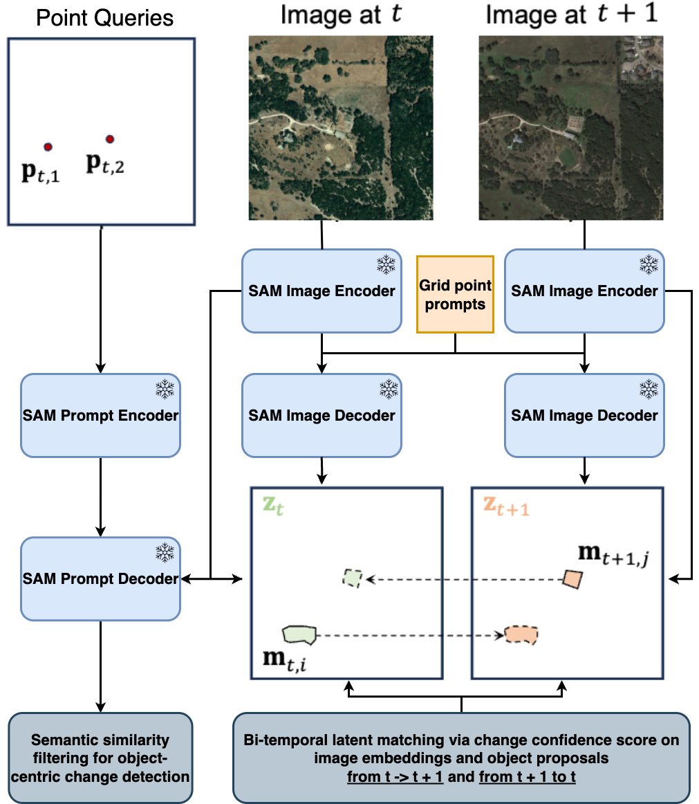

<div align="center">
    
<h1>Forest-Chat: Adapting Vision-Language Models for Interactive Forest Change Analysis</h1>

**[James Brock](https://github.com/JamesBrockUoB/)**

<div align="center">
  
</div>
</div>

## Table of Contents
- [LEVIR-MCI dataset](#LEVIR-MCI-dataset)
- [Forest-Change dataset](#Forest-Change-dataset)
- [Training of MCI model](#Training-of-the-multi-level-change-interpretation-model)
- [Construction of Forest-Chat Agent](#Construction-of-Change-Agent)
- [Citation](#Citation)

### Preparation
<details open>
  
  - **Environment Installation**:

    **Step 1**: Create a virtual environment named `Multi_change_env` and activate it.
    ```python
    conda create -n Multi_change_env python=3.9
    conda activate Multi_change_env
    ```
    
    **Step 2**: Download or clone the repository.
    ```python
    git clone https://github.com/JamesBrockUoB/ForestChat.git
    cd ./ForestChat/Multi_change
    ```
    
    **Step 3**: Install dependencies.
    ```python
    pip install -r requirements.txt
    ```

    **Step 4**: Setup .env file.
    Create a file in the project root folder called `.env` with the following variables:
      - OPEN_AI_KEY: Your OPEN_AI API key - https://platform.openai.com/api-keys
      - SERPER_API_KEY - Your Google Search / Scholar API key - https://serpapi.com/
      - WANDB_USERNAME - Your Weights & Biases username for run logging - https://wandb.ai/site/
</details>

## LEVIR-MCI dataset 
  <details open>
  - Download the LEVIR_MCI dataset: [LEVIR-MCI](https://huggingface.co/datasets/lcybuaa/LEVIR-MCI/tree/main).
  - This dataset is an extension of the previously established [LEVIR-CC dataset](https://github.com/Chen-Yang-Liu/RSICC). It contains bi-temporal images as well as diverse change detection masks and descriptive sentences. It provides a crucial data foundation for exploring multi-task learning for change detection and change captioning.
    <br>
    <div align="center">
      
    </div>
    <br>
  - The data structure of LEVIR-MCI is organized as follows:
    ```
    ├─/DATA_PATH_ROOT/Levir-MCI-dataset/
            ├─LevirCCcaptions.json
            ├─images
                 ├─train
                 │  ├─A
                 │  ├─B
                 │  ├─label
                 ├─val
                 │  ├─A
                 │  ├─B
                 │  ├─label
                 ├─test
                 │  ├─A
                 │  ├─B
                 │  ├─label
    ```
    where folder ``A`` contains pre-phase images, folder ``B`` contains post-phase images, and folder ``label`` contains the change detection masks.

  - **Extract text files for the descriptions of each image pair in LEVIR-MCI**:

    ```
    python preprocess_data.py --dataset LEVIR_MCI-dataset --captions_json LevirCCcaptions.json
    ```

    If you wish to create a subset of LEVIR-MCI that explicitly contains changes to trees called `LEVIR-MCI-Trees`, then add: --keep_only_trees True
    After that, you can find some generated files in `./data/LEVIR_MCI/`. 
  </details>

## Forest-Change dataset
<details open>
- Data is available in the `Multi_change/data/Forest-Change` folder and can be prepared by running `python preprocess_data.py` in `Multi_change`.
- If you wish to download the original data and create your own captions, then download the images from [here](https://www.kaggle.com/datasets/asheniranga/change-detection-in-forest-covers)
- Name the downloaded folder as `archive`, and place it in the `Multi_change/data` folder
- In the `dataset_utils_notebook.ipynb` file in the project root, run the first three code blocks to format the downloaded data as required
- This should create the `Forest-Change-dataset` folder in the /data directory.
- From here, you can run the captioning app via `streamlit run captioning_app.py` in the `/Multi_change` directory. This will allow you to provide a single human annotated caption, and optionally four rule-based captions per sample. Future work will allow for any number of human captions to be provided.
- Once captioning is complete, the data can be pre-processed as needed by running `python preprocess_data.py` in `/Multi_change`
<br>
  <div align="center">
    
  </div>
<br>
</details>

### Download AnyChange model for Zero-shot segmentation
  <details open>

  AnyChange provided out-of-the-box zero-shot bi-temporal change detection segmentation for the Forest-Chat agent.
  
  Link: [AnyChange](https://github.com/facebookresearch/segment-anything?tab=readme-ov-file#model-checkpoints)

  Place the downloaded model into: `Multi_change/models_ckpt/` with the name unchanged (`sam_vit_h_4b8939.pth`)

  Simplified overview of the AnyChange model:
  <br>
  <div align="center">
        
  </div>
  </details>

## Training of the adapted multi-level change interpretation model
The overview of the MCI model as adapted to Forest-Chat:
<br>
    <div align="center">
      
    </div>
<br>

### Train
Make sure you performed the data preparation above. Then, start training as follows:
```python
python train.py --train_goal 2 --data_folder /DATA_PATH_ROOT/Levir-MCI-dataset/images --savepath ./models_ckpt/
```
This is now configured to use the Forest-Change dataset by default, check commandline arguments and hard-coded constants for parameters that require updating to use LEVIR-MCI. E.g. NUM_CLASSES has been changed from 3 to 2.

### Evaluate
```python
python test.py --data_folder /DATA_PATH_ROOT/Levir-MCI-dataset/images --checkpoint {checkpoint_PATH}
```
We recommend training the model 5 times to get an average score.

This is now configured to use the Forest-Change dataset by default, check commandline arguments and hard-coded constants for parameters that require updating to use LEVIR-MCI. E.g. NUM_CLASSES has been changed from 3 to 2.

### Inference
Run inference to get started as follows:
```python
python predict.py --imgA_path {imgA_path} --imgB_path {imgA_path} --mask_save_path ./CDmask.png
```
You can modify ``--checkpoint`` of ``Change_Perception.define_args()`` in ``predict.py``. Then you can use your own model, of course, you also can download our pretrained model ``MCI_model.pth`` here: [[Hugging face](https://huggingface.co/lcybuaa/Change-Agent/tree/main)]. After that, put it in `./models_ckpt/`.

This is now configured to use the Forest-Change dataset by default, check commandline arguments and hard-coded constants for parameters that require updating to use LEVIR-MCI. E.g. NUM_CLASSES has been changed from 3 to 2.

## Construction of Change-Agent
<br>
<div align="center">
      
</div>

- **Agent Installation**:
    ```python
    cd ./ForestChat/lagent-main
    pip install -e .[all]
    ```
- **Run Agent**:

    cd into the ``Multi_change`` folder:
    ```python
    cd ./ForestChat/Multi_change
    ```
    (1) Run Agent Cli Demo:
    ```bash
    # You need to install streamlit first
    # pip install streamlit
    python try_chat.py
    ```
        
    (2) Run Agent Web Demo:
    ```bash
    # You need to install streamlit first
    # pip install streamlit
    streamlit run web_demo.py
    ```
    <br>
    <div align="center">
          
    </div>

## Acknowledgement
Thanks to the following repositories:

[Change-Agent](https://github.com/Chen-Yang-Liu/Change-Agent/tree/main); [AnyChange](https://github.com/Z-Zheng/pytorch-change-models/tree/main/torchange/models/segment_any_change); [lagent](https://github.com/InternLM/lagent)

## License
This repo is distributed under [MIT License](https://github.com/JamesBrockUoB/ForestChat/blob/main/LICENSE). The code can be used for academic purposes only.

